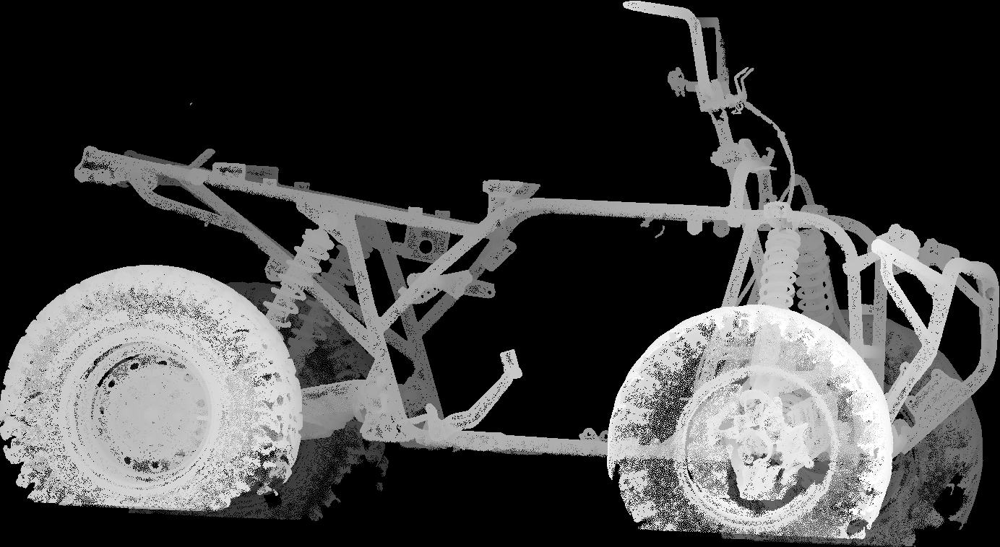
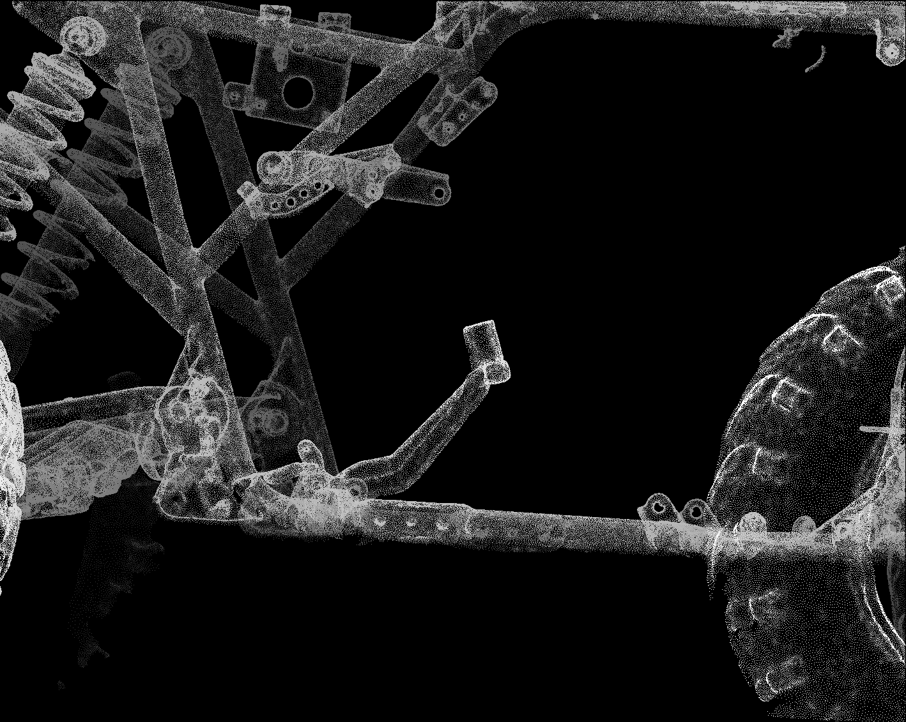
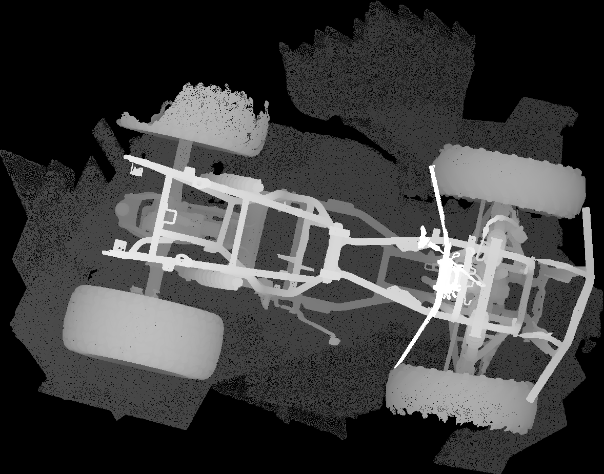
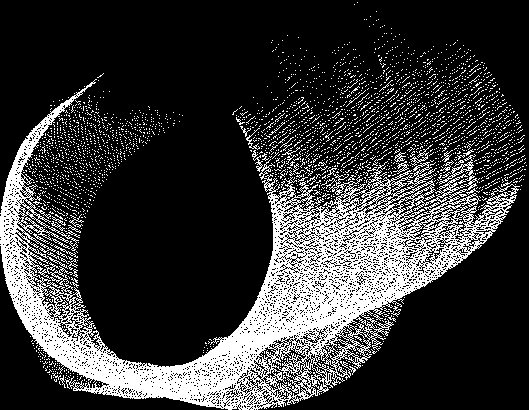
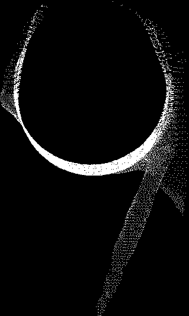

# Scan-to-CAD base: options and ranking

14 September 2026

## Answer

AI can carry the heavy lifting on this modelling job, but not the part the market
advertises. Nothing shipping in September 2026 rebuilds a vehicle chassis from a scan.
What AI does reliably today is three things: run a scripted mesh-conditioning pipeline,
fit geometric primitives to cropped regions of the scan with a human check, and write and
execute the parametric CAD that produces STEP, drawings and flat patterns. That is enough
here, because the design only needs the interfaces reverse-engineered and the rest of the
scan stays as a reference mesh. Conversion shops work the same way: Fellten, Jaunt,
Electrogenic and EV West all keep the scan as a fit-check backdrop and model only the
mating features.

The scan is better than the README assumed. It is the stripped rolling chassis: bare
frame, both differentials, suspension, wheels and steering, with the engine bay empty and
the engine-mount plates and their bolt holes resolved even in the low-res export. The fuel
tank, seat, bodywork and CVT ducting are not in it.

### Ranking

The options compose rather than compete. Option 1 is the foundation for everything else,
2 is the default for interface capture and design, 3 is a cheap parallel ask, and 4 and 5
are escalations.

| # | Option | Cost | Evidence |
| --- | --- | --- | --- |
| 1 | **Scripted conditioning pipeline.** PyMeshLab, Open3D and trimesh in a Python venv, CloudCompare's RANSAC shape detection for multi-primitive segmentation, all written and run by Claude Code. | Nil | Run on this file today. Full-res cleaned and decimated in 12 min; a round tube fitted at 0.40 mm RMS. |
| 2 | **Fusion 360 as the reference workspace.** Cropped meshes as backdrop; Mesh Section Sketch and Fit Curves for tube runs; Autodesk Assistant and the Fusion MCP for scripted features, sheet metal and DXF flat patterns. | Commercial Fusion A$985/yr; A$739 first year under a promotion ending 21 Sep 2026 | Documented. Autodesk caps mesh-to-solid conversion at 10,000 elements and says Prismatic conversion is not for scan data, so the scan is never converted, only referenced. |
| 3 | **Re-exports from the scanning provider's Artec project.** Cleaned floor-free mesh, OBJ or PLY with colour, fitted planes and cylinders as STEP, section sets on named planes. | A request | Artec Studio 20 fits constrained primitives and exports STEP, IGES and X_T. Whether the provider still holds the project is unknown. |
| 4 | **Backflip AI on cropped bosses and brackets.** | 60 free credits, then US$20/month | The only shipping mesh-to-feature-tree product. One independent test on small parts lost fine detail; no published result on a tube frame; vendor scope is 3-axis milled and turned parts. |
| 5 | **Dedicated reverse-engineering software.** QuickSurface Pro, or Geomagic Design X. | QuickSurface Pro A$2,900/yr with a 30-day trial; Design X Go US$1,900/yr, and the Pipe Wizard is Pro at US$7,280/yr | The proper route. QuickSurface's bicycle-frame case study finished a whole frame in under 1.5 h. Escalate only if the tube runs stall in options 1 and 2. |

Excluded with reasons:

- Text- and image-to-3D generators (Meshy, Tripo, Hunyuan3D, TRELLIS) emit meshes with no
  B-rep, no dimensions and no relation to the scan.
- Research point-cloud-to-CAD models (CAD-Recode, cadrille, HoLa, Point2CAD) are trained
  on single small parts; only HoLa reports results on real scans and it has no public
  weights. CAD-Recode is licensed non-commercial.
- Zoo Design Studio imports meshes as read-only reference and has no mesh-to-KCL path.
- Blender has no B-rep, STEP, sheet-metal or drawing output.

## What the scan contains

Present: frame, both differentials, front propeller-shaft stub at the front differential,
swingarm and rear axle housing, A-arms, shocks, wheels and tyres, steering and handlebars,
front bumper. Absent: engine, CVT and its moulded ducting, fuel tank, seat, racks'
plastics, bodywork.

| Measured | Low-res | Full-res |
| --- | --- | --- |
| Faces | 1 844 914 | 35 074 344 |
| Unique vertices | 949 257 | 17 640 311 |
| Connected pieces | 126; the largest holds 77% of faces | Fragments under 0.01% of faces total 0.13% |
| Surface area | 5.51 m² | 8.26 m² |
| Floor | Absent; largest plane holds 1.3% of vertices | Present; 13.9% of vertices in the 1 M decimation |
| Boundary edges | 58 630 | Not measured |
| Non-manifold edges | 0 | Not measured |
| Degenerate faces | 0 | Not measured |

The 2.7 m² difference is the floor. The full-res export carries a large irregular patch of
ground under and around the machine; the low-res export had it removed.

Orientation: Z is up. The mesh is yawed about 29° in its own frame and the floor normal is
2.7° off the scan's Z axis. Principal-component alignment is not a usable datum because
the wheels and racks skew it. The vehicle datum has to come from the floor plane for Z,
the frame's symmetry plane for Y and an axle or flange face for the X origin. The floor
plane fits with 1.18 mm RMS on the 1 M mesh, which is good enough for Z.

### Frame members

The frame is round tube of at least two sizes with plates and tabs welded alongside.
Circle fits give outside diameters of 25.9 mm and 36.9 mm; callipers should confirm both.

| Member and mesh | Radius | Inliers | RMS | 95th percentile |
| --- | --- | --- | --- | --- |
| Cross-member, low-res | 13.47 mm | 89.7% | 0.88 mm | not recorded |
| Cross-member, full-res | 12.94 mm | 92.6% | 0.40 mm | 0.80 mm |
| Lower rail, full-res, box crop | 18.43 mm | 98.2% | 4.04 mm | 8.79 mm |

The cross-member fit shows what the scan can do: a tube resolved to well under half a
millimetre at full resolution, and twice as well as the low-res export. The rail fit
shows what a naive approach cannot do: a box crop takes in the welded plate and the
circle fit degrades to 4 mm RMS. Members have to be segmented into planes and cylinders
before fitting. That is what CloudCompare's RANSAC shape detection, QuickSurface's
primitive extraction and Design X's regions all do, and it is why option 1 names
CloudCompare rather than relying on a single-model fit.

### Consequences

- Full-res crops for interface fitting; the 1 M or 200 k decimations for the CAD backdrop.
- The tank envelope, seat base and plastics need a second scan or physical measurement
  before the controller box is drawn.
- The README states that the CVT ducts and fan bracket are in the scan. The renders do
  not show them; the engine bay is bare.

## Evidence from this machine

Workstation: i7-12700KF, 20 threads, 31.8 GB RAM, GTX 1060 3 GB. The full-res file is
local on the project drive and reads sequentially at about 626 MB/s.

| Operation | Tool | Time | Memory |
| --- | --- | --- | --- |
| Parse low-res binary STL | numpy | 0.2 s | small |
| Unique vertices, low-res | numpy | 2.7 s | small |
| Connected components, low-res | scipy | 0.2 s | small |
| Stream full-res in 4 M-face chunks and crop | numpy | 200 s | under 1 GB |
| Load full-res | PyMeshLab | 154 s | 10.7 GB |
| Remove fragments, duplicates, null faces | PyMeshLab | 20 s | 11.9 GB |
| Save cleaned PLY, 878 MB | PyMeshLab | 5 s | 11.9 GB |
| Decimate 35 M to 5 M faces | PyMeshLab | 435 s | about 18 GB peak |
| Decimate 5 M to 1 M faces | PyMeshLab | 59 s | 6.6 GB |
| Load low-res | PyMeshLab | 7.9 s | 0.6 GB |
| Decimate 1.8 M to 500 k, then 150 k | PyMeshLab | 18.7 s, 4.7 s | 0.8 GB |
| Read, cluster, decimate to 500 k, low-res | Open3D | 2.5 s, 2.2 s, 19.0 s | 0.5 GB |
| Load, split, section, low-res | trimesh | 2.4 s, 3.3 s, 0.2 s | small |
| Floor plane RANSAC on the 1 M mesh | Open3D | 0.3 s | small |
| Single-cylinder RANSAC, 750 points | pyransac3d | 1.2 s | small |

What these runs establish, and what failure would have looked like:

- The full-res file is tractable on this PC with free tools. Failure would have been an
  out-of-memory kill or an hours-long run; the peak was 18 GB of the 32 GB available.
- The full-res mesh resolves a tube to 0.40 mm RMS. Failure would have been several
  millimetres, as the contaminated rail crop produced.
- Box cropping is not a segmentation. The rail fits failed exactly as expected, which is
  why the pipeline needs multi-primitive detection before fitting.
- numpy's `np.fromfile` returned zero records on the 1.75 GB file; chunked `readinto`
  streams it without issue.
- pyransac3d agreed with the normals-based fit on the cross-member radius but kept only
  20% of points as inliers, and its own documentation says its cylinder model does not
  perform well on real data. It is fine for planes, not for the rails.

Not established today: any run inside Fusion, because Fusion was not yet installed; a
symmetry-plane fit; a full multi-primitive segmentation of the engine bay.

## The AI landscape for manufacturable output

### Scan in, CAD out

- **Backflip AI** is the one shipping product that turns a mesh into an editable feature
  tree, as a Fusion add-in with a native timeline or as STEP from the web app. Input is
  STL, OBJ, PLY, GLB or GLTF; no triangle limit, tolerance or API is published. The single
  independent test (engineering.com, August 2026) found that fine notches and thin walls
  were frequently lost, while a simple adaptor ring came out near-flawless in the slower
  mode. The vendor's own scope is moderate-complexity 3-axis milled and turned parts. Its
  place here is an experiment on one cropped mount bracket, not a plan.
- **Fusion's Convert Mesh** is not a route. Autodesk's support articles set a ceiling of
  10,000 elements for successful conversion and state that the Prismatic method is meant
  for meshes exported from other CAD software, not scan data. Personal-use licences do not
  include Prismatic at all.
- **Research models** that take a point cloud and emit CAD (CAD-Recode, cadrille,
  CADReasoner, HoLa, ParaCAD, Point2CAD) are trained on DeepCAD, ABC and Fusion 360
  Gallery parts normalised to a unit cube. None has been demonstrated on anything like a
  chassis. cadrille is Apache-licensed with public weights and is the only candidate for
  a weekend experiment on a cropped point cloud.
- **Dedicated reverse-engineering software** is not AI but is where the automation is:
  QuickSurface extracts constrained planes, cylinders, cones and spheres, aligns the mesh
  to world coordinates from them and exports STEP; Geomagic Design X Pro adds automatic
  regions and a Pipe Wizard that returns a centreline from a tube region. Hexagon has owned
  Geomagic since April 2025.

### Text or code in, CAD out

- **Autodesk Fusion.** Autodesk Assistant left tech preview and is generally available in
  the 3 September 2026 release; it runs sketches, extrudes, fillets, holes, patterns and
  parameter edits, and since April 2026 can write and execute Fusion API scripts. The
  official local Fusion MCP is listed as generally available and works with Claude
  Desktop or any MCP client against a running Fusion session. Autodesk's own sample server
  exposes one tool that executes API scripts and one that takes screenshots, and its
  guidance says building components from sketches is often out of scope. Community
  servers add an `execute_python` tool and, in one case, sheet-metal flange, bend and
  flat-pattern tools. One second-hand report quotes Autodesk support saying third-party
  AI tools cannot be integrated on a personal-use licence.
- **Fusion API.** Sheet-metal features, unfold and flat pattern are scriptable, and the
  DXF flat-pattern export writes outer and inner profiles, bend centre lines and extent
  lines on separate layers with a K-factor from the rule table. This is the most mature
  scripted flat-pattern route available. Drawings can be created automatically through
  the API but dimensions are still placed by hand.
- **Code-CAD.** build123d and CadQuery produce STEP B-rep from Python and run headless
  inside Claude Code on Windows on the `cadquery-ocp` 7.9 wheels. Neither has sheet-metal
  unfold; build123d's request for it has been open since 2023. Dimensioned PDF drawings
  from script exist in exactly one place, draftwright, which is alpha. FreeCAD's
  SheetMetal workbench unfolds with K-factor tables and writes bend lines to DXF, and its
  Python entry points are GUI-free by inspection of the source.
- **How well language models write this code.** Text2CAD-Bench (May 2026) puts the best
  model at 11% invalid output on basic parts and 68% invalid on parts with fillets,
  sweeps and lofts. BenchCAD found 64% of nominally successful edits silently corrupt
  unrelated features. The chain-drive housing lives in exactly that territory, so
  verification (measure, interference-check, render) is part of the loop, not an option.
- **Onshape** shipped a FeatureScript MCP server through Onshape Labs in August 2026; the
  agent writes and debugs a real parametric feature. It needs a paid seat and a platform
  switch, and no outsider has evaluated it.
- **Zoo** exports STEP from KCL through a CLI and an MCP server but has no sheet metal or
  drawings until 2027 and treats meshes as reference only.

### How conversion shops do it

Fellten imports scan data into Fusion to check fit before prototyping. Jaunt Motors
scanned a Land Rover chassis and engine bay with an Artec Leo, overlaid batteries on the
mesh, refined in Fusion and handed the fabricator PDF drawings and DXF for the laser.
Electrogenic scans the gearbox housing and engine bay; EV West scans the transmission and
flywheel to design adapter plates. None describes remodelling a frame. No quad or ATV
conversion build log that used a scan was found.

## Proposed pipeline

The stages match the README's workflow table. Options 3 to 5 slot into interface capture
if needed; they do not change the shape of the pipeline.

| Stage | Tools | AI does | Human does | Output |
| --- | --- | --- | --- | --- |
| Condition | PyMeshLab, Open3D | Remove fragments; fit the floor plane and cut everything below it; fit the symmetry plane; set X from an axle or flange; apply the transform; export 5 M, 1 M and 200 k variants in millimetres | Check the datum against tape measurements of track, wheelbase and rail spacing | Cleaned, aligned PLY and STL; the transform recorded as a matrix |
| Crop | trimesh, PyMeshLab | Cut named regions: engine bay, tank mounts, front and rear flanges, duct route | Name the regions | One full-res mesh per region |
| Segment and fit | CloudCompare RANSAC, numpy | Sample each crop to points; detect planes and cylinders with radius bracketed to calliper OD ± 0.5 mm; tabulate axes, radii and plane normals; skeletonise bends if needed | Reject false primitives; supply calliper values | Primitive table with residuals |
| Interface capture | build123d, or the Fusion API | Build sweeps along fitted axes, mount planes, boss cylinders and bolt patterns at calliper spacing; export STEP; report cloud-to-mesh deviation | Confirm bolt sizes, threads, bush bores and flange data from the parts | Interface STEP with a deviation map |
| Design | build123d for the drive housing and brackets; Fusion sheet metal for boxes, ducts and the finned base | Generate parametric parts from the parameter table; interference and clearance assertions; multi-view renders | Design judgement; ratio and packaging decisions | STEP assemblies |
| Handover | Fusion drawings and flat patterns; draftwright for plate and shaft drawings | Auto-create drawings and DXF R14 flat patterns with bend lines; cut list | Place and check dimensions, welds, tolerances and adjustment ranges | STEP, PDF, DXF, cut list, reference STL |

## Interfaces to measure by hand

- Tube outside diameter and wall. Fusion smoothing and decimation bias fitted radii, and
  the RANSAC radius bracket needs the true value.
- Engine-mount hole diameters, threads, bush bores and hole spacings. Small metallic holes
  are where structured light fails; the scan gives the mount plane and the boss axis, not
  the bore.
- Propeller-shaft flange PCD, pilot diameter, bolt size, spline data and yoke plunge. The
  scan gives axis and face position only.
- Chain line and sprocket coplanarity. The 0.1 to 0.2 mm per 100 mm the chain wants is
  below whole-vehicle scan accuracy; build it adjustable and set it on assembly.
- Suspension position at scan time. Propeller-shaft operating angles must be confirmed
  at ride height under the final mass, because the scan may have been taken with the
  suspension at droop.

Universal-joint guidance: operating angles between 0.5° and 3°, and the two ends equal
within 1°, or within 0.5° for shafts ahead of a transfer position. A 1 mm positional
error over a 300 mm shaft is about 0.2°, so shaft angles from the scan are usable
against that rule.

## Decisions

1. **Fusion licence.** The commercial subscription is the one that carries Prismatic
   conversion and, by one report, AI tool integration, and the personal-use terms exclude
   commercial work. The 25% first-year promotion ends 21 September 2026.
2. **Ask the scanning provider** for re-exports from the Artec project: the cleaned mesh
   without the floor, OBJ or PLY with colour, the fusion resolution and any shape-deviation
   decimation used, whether hole filling was applied, and STEP of any planes or cylinders
   they can fit to the engine-bay rails and mount plates.
3. **Second scan or measurement** of the fuel tank, seat base and side plastics, and the
   CVT ducts if the duct route is to be reused.
4. **Whether to trial QuickSurface** now, in parallel with option 1, or hold it as the
   escalation.
5. **README correction** on the ducts and fan bracket.

## Not verified

- The exact tool list of the official Fusion MCP, and whether it exports STEP or DXF
  itself.
- Autodesk's own article on personal-use licences and AI tools; the claim is second-hand.
- Backflip's input size limits and any tolerance figure.
- Whether the scanning provider still holds the Artec project or will re-export.
- Geomagic Design X pricing from Hexagon directly; whether the Pipe Wizard sits in the Pro
  tier only. Reseller price books say it does.
- QuickSurface's claim of handling 100 million triangles, and whether it can be scripted.
- Any published behaviour of Fusion with a 1 M-face reference mesh; the 10,000-element
  figure is for conversion, not display.
- The FreeCAD SheetMetal headless unfold; read from source, not run.
- Whether the King Quad LT-A400F engine mounts are rubber-bushed.
- The dedicated library-documentation research stream did not complete; the pipeline stack
  rests on the runs above and on the scan-to-CAD stream's coverage of the open-source
  tools.

## Sources

- Autodesk, Converting 3D scan mesh to Prismatic solid in Fusion, 27 Jan 2026: https://www.autodesk.com/support/technical/article/caas/sfdcarticles/sfdcarticles/Converting-3D-scan-mesh-to-Prismatic-solid-in-Fusion-360.html
- Autodesk, Slow performance after inserting or converting a mesh, 15 Jul 2026: https://www.autodesk.com/support/technical/article/caas/sfdcarticles/sfdcarticles/Fusion-360-performance-slows-after-inserting-mesh.html
- Autodesk, The Prismatic option is missing on a personal-use licence, 13 Aug 2026: https://www.autodesk.com/support/technical/article/caas/sfdcarticles/sfdcarticles/The-prismatic-option-is-missing-in-the-convert-mesh-menu-in-Fusion-360.html
- Autodesk, Fusion September 2026 update: https://www.autodesk.com/products/fusion-360/blog/september-2026-major-product-update-whats-new/
- Autodesk, Introducing the Fusion MCP, 7 May 2026: https://www.autodesk.com/products/fusion-360/blog/introducing-the-fusion-mcp-opening-fusion-to-ai-powered-workflows/
- Autodesk, FusionMCPSample: https://github.com/AutodeskFusion360/FusionMCPSample
- Autodesk, Fusion mesh section sketch: https://help.autodesk.com/cloudhelp/ENU/Fusion-Mesh/files/MESH-CREATE-MESH-SECTION-SKETCH.htm
- Autodesk Australia, Fusion extensions and pricing: https://www.autodesk.com/au/products/fusion-360/extensions
- Autodesk, Backflip add-in for Fusion, 19 Aug 2026: https://www.autodesk.com/products/fusion-360/blog/backflip-add-in-autodesk-fusion/
- engineering.com, Backflip's back: is the mesh-to-CAD AI real this time?, 4 Aug 2026: https://www.engineering.com/backflips-back-is-the-mesh-to-cad-ai-real-this-time/
- Backflip pricing: https://www.backflip.ai/pricing
- Hexagon, Geomagic Design X plans: https://hexagon.com/products/geomagic-design-x/geomagic-design-x-plans
- Rev1 Tech, Geomagic Design X price book: https://rev1tech.com/shop/software/reverse-engineering/geomagic-design-x
- QuickSurface pricing: https://www.quicksurface.com/price/
- Smart Technology, QuickSurface Australian pricing: https://smarttechnology.com.au/quicksurface-3d-surface-to-cad-software/
- QuickSurface, bike frame case study, 16 Dec 2025: https://www.quicksurface.com/case-study-reverse-engineering-a-bike-frame-with-quicksurface/
- Artec Studio 20, CAD primitives: https://docs.artec3d.com/as/20/en/cad.html
- CloudCompare, RANSAC shape detection command-line keywords: https://raw.githubusercontent.com/CloudCompare/CloudCompare/master/plugins/core/Standard/qRANSAC_SD/include/qRANSAC_SD_Commands.h
- pyransac3d cylinder documentation: https://leomariga.github.io/pyRANSAC-3D/api-documentation/cylinder/
- Text2CAD-Bench, May 2026: https://arxiv.org/html/2605.18430
- BenchCAD, May 2026: https://arxiv.org/html/2605.10865v1
- cadrille: https://github.com/col14m/cadrille
- Onshape, FeatureScript MCP server, 11 Aug 2026: https://www.onshape.com/en/blog/featurescript-mcp-server-enables-text-code-cad
- Zoo roadmap: https://zoo.dev/roadmap
- build123d sheet-metal issue: https://github.com/gumyr/build123d/issues/305
- draftwright: https://github.com/pzfreo/draftwright
- FreeCAD SheetMetal workbench: https://github.com/shaise/FreeCAD_SheetMetal
- DEVELOP3D, Fellten, 1 Dec 2025: https://develop3d.com/sponsored/fellten-bringing-classic-cars-into-the-electric-era/
- Shapr3D, Jaunt Motors case study, 1 Aug 2022: https://www.shapr3d.com/content-library/building-a-movement-for-electric-vehicles
- Spicer, driveline operating angle: https://spicerparts.com/calculators/driveline-operating-angle-calculator
- Wippermann, chain drive alignment: https://wippermann.com/en/service/maintenance/alignment-chain-drives
- Fused Fabrications, preparing your file: https://fusedfabrications.com.au/preparing-your-file/
