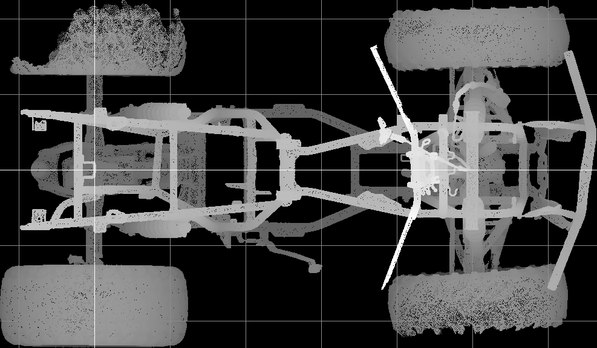
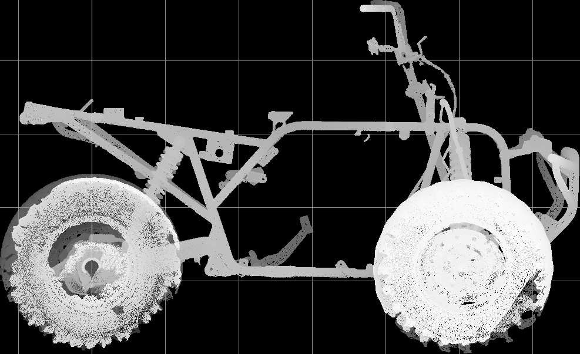

# Condition report

Faces: loaded 35074344, after fragments 35027805, after floor 31097206.

## Datum agreement against artefacts/datum-reference.json

Axis angle differences (deg): X 0.014, Y 0.047, Z 0.048 (accept under 0.5).
Translation differences (mm): [0.36, 0.06, 0.02] (accept under 5).

## Floor and symmetry

Floor: inliers fraction 0.1609, RMS 1.209 mm.
Symmetry: rotation from PCA 11.617 deg, final fitness 0.5389, final RMSE 3.177 mm.

## Rear axle housing

Left: r=24.35 y=273.0 z=296.8 rms=0.76
Right: r=25.42 y=-265.4 z=300.7 rms=0.75
X span between sides: 0.58 mm.

## Renders

